# QTBookManagerSystem 

**QT图书管理系统是一个基于QT的开源跨平台软件，使用sqlite作为数据库，内置一个管理员账户。**
详细功能如下：

1. 学生端
	* 修改密码
	* 图书查询
	* 图书借阅
	* 图书归还
2. 管理员
	* 用户查询
	* 用户导入
	* 删除用户
	* 图书查询
	* 添加书籍
	* 更改书籍
	* 删除书籍
	* 清空记录

---

## 目录
1. 程序总体流程
	> * 1.1 登录界面
	> * 1.2 学生端界面
	> * 1.3 管理员界面
2. 程序功能介绍
	> * 2.1 学生端
	> > * 2.1.1 账户管理
	> > * 2.1.2 图书借阅
	> > * 2.1.3 借阅情况
	> * 2.2 管理员
	> > * 2.2.1 用户管理
	> > * 2.2.2 图书管理
	> > * 2.2.3 借阅查询

---
**Github仓库地址：**[jijijitian/QTBookManagerSystem](https://github.com/jijijitian/QTBookManagerSystem)

---
## 程序总体流程
### 登录界面
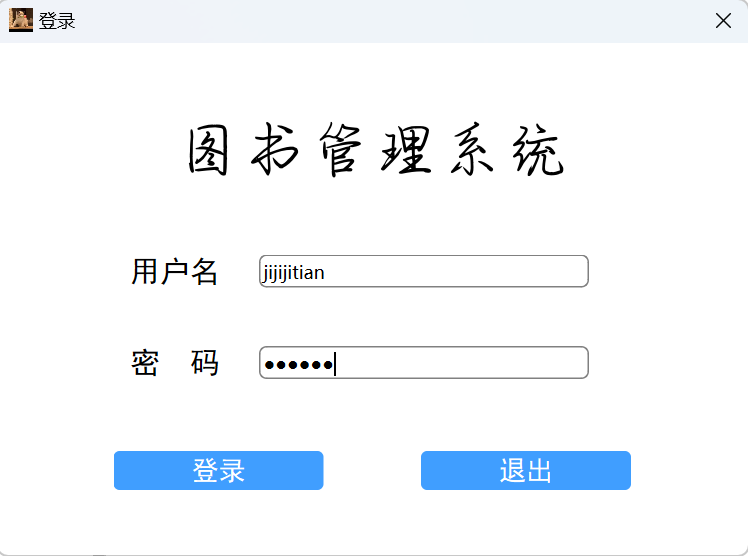
* 其中密码输入框设置为密码样式，不以明文显示。登陆界面总体采用element ui 风格，程序会自动判断登录用户的权限，实现学生和管理员用一个登录窗口进入不同的界面。

### 学生端界面
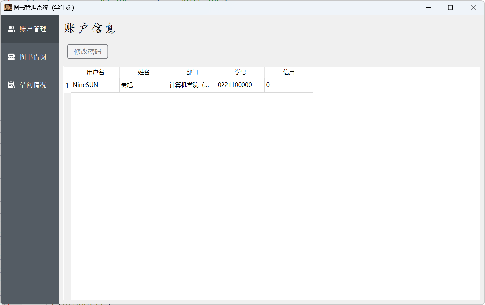
* 学生主窗口分为两个部分，左边功能菜单采用element ui风格，点击不同选项以实现右侧窗口的切换。
* 功能区分为三个，分别为账户管理、图书借阅和借阅情况。
* 右侧为功能区，上边是功能选项，点击可实现不同功能，下边是查询区，用以显示数据库中的数据。

### 管理员界面
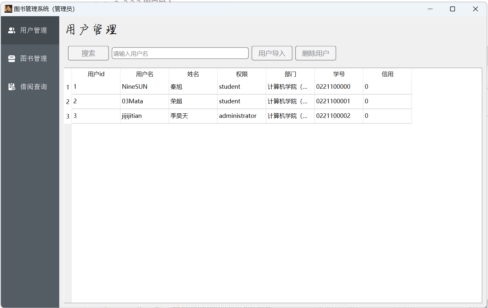

* 管理员主窗口和学生端一样分为两个部分。
* 左侧功能区分别为用户管理、图书管理和借阅查询三个部分。

---

## 程序功能介绍

### 学生端

#### 账户管理

在账户管理界面显示者当前登录学生的账户信息

* 上方有修改密码的功能键，点击后会弹出修改密码对话框，等待两次输入密码均正确后修改数据库中存储的账户密码，修改密码后不会退出登录，可以继续使用。

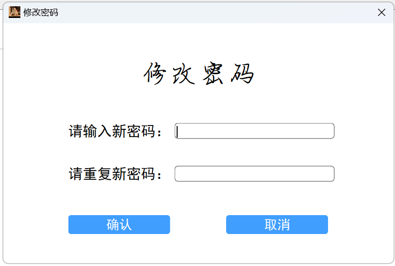

* 若输入的密码有误，则会弹出错误提示

  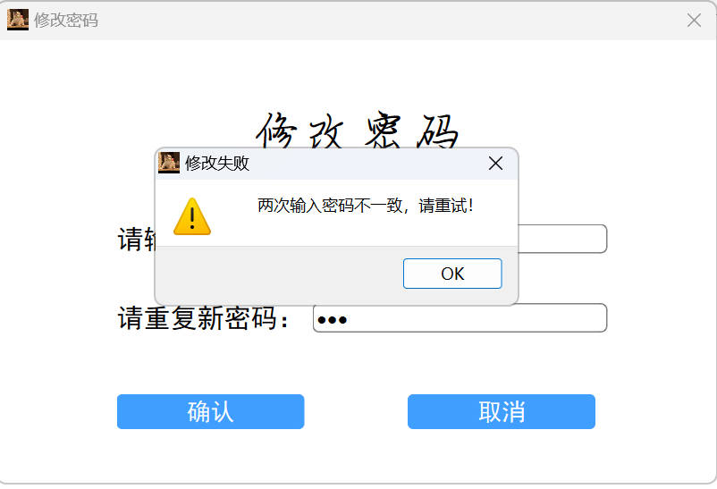

* 若两次输入的密码一致则成功修改

  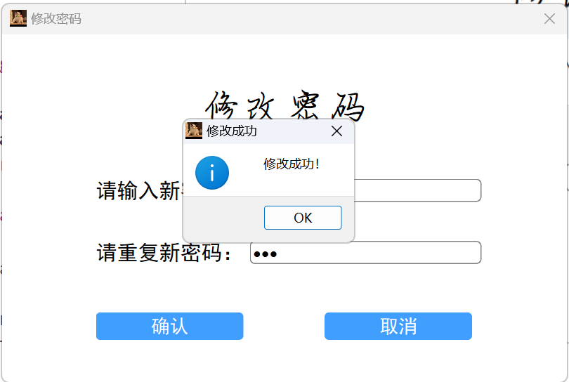
  
#### 图书借阅

在图书借阅界面显示数据库中图书的信息，上方带有搜索框，支持模糊搜索点击搜索实时更新下方书籍信息。

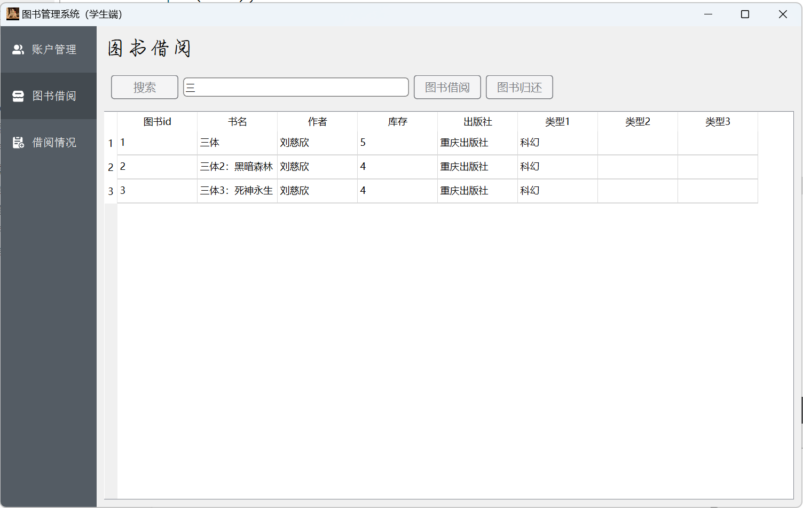

* 上方带有两个功能按钮。

* 点击图书借阅，输入所要借阅的图书id，若符合要求即可借阅成功（不能重复借阅，借阅的总数不得超过三本），若不符合要求则会弹出相应的错误提示。

  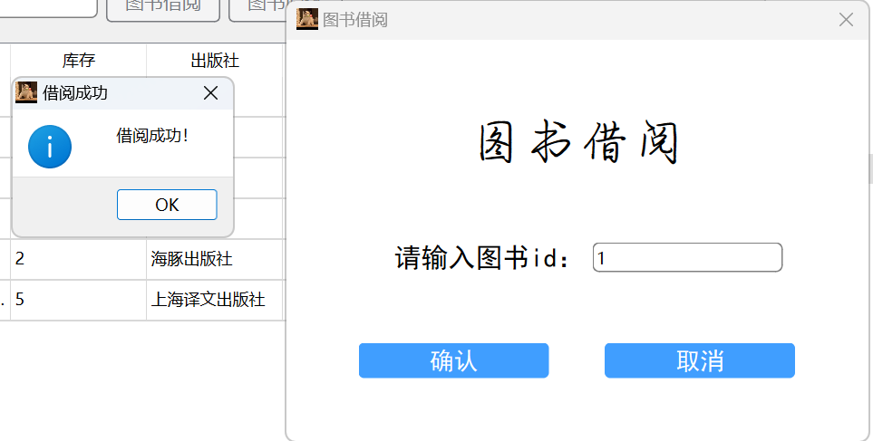

然后主界面的图书信息会实时更新

* 点击图书归还，弹出的窗口有一个下拉选择框，会显示已借阅的图书，选择需要归还的图书点击确定即可归还

  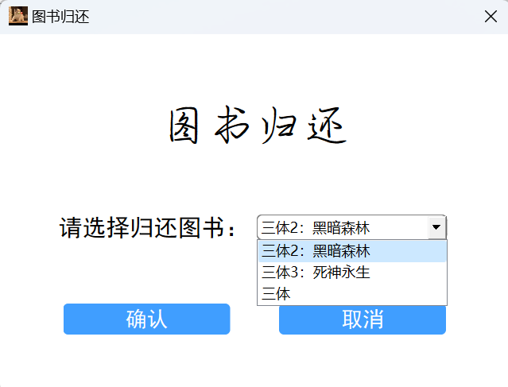

#### 借阅情况

* 借阅情况显示学生近期的借阅情况，点击刷新按钮即可刷新

  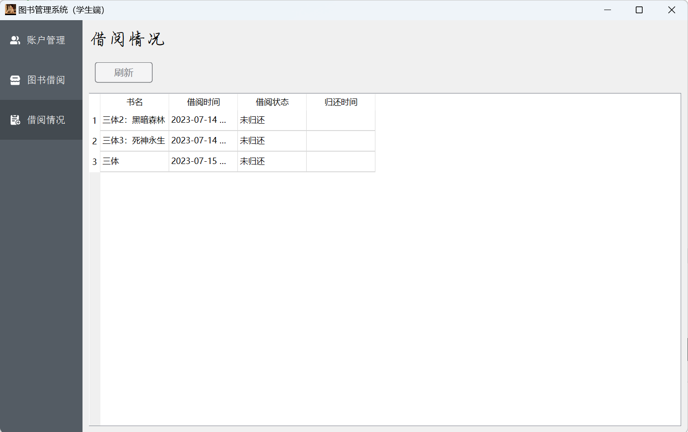

---

### 管理员

#### 用户管理

* 管理员登陆后首先是用户管理页面，用户管理页面中展示了所有数据库中存储的账户信息，便于管理员进行管理

  

* 上方有两个功能按键，分别是用户导入和删除用户

* 考虑到学校一般新入学的学生较多，本系统采用批量导入的形式，目前支持csv格式的文件进行导入

  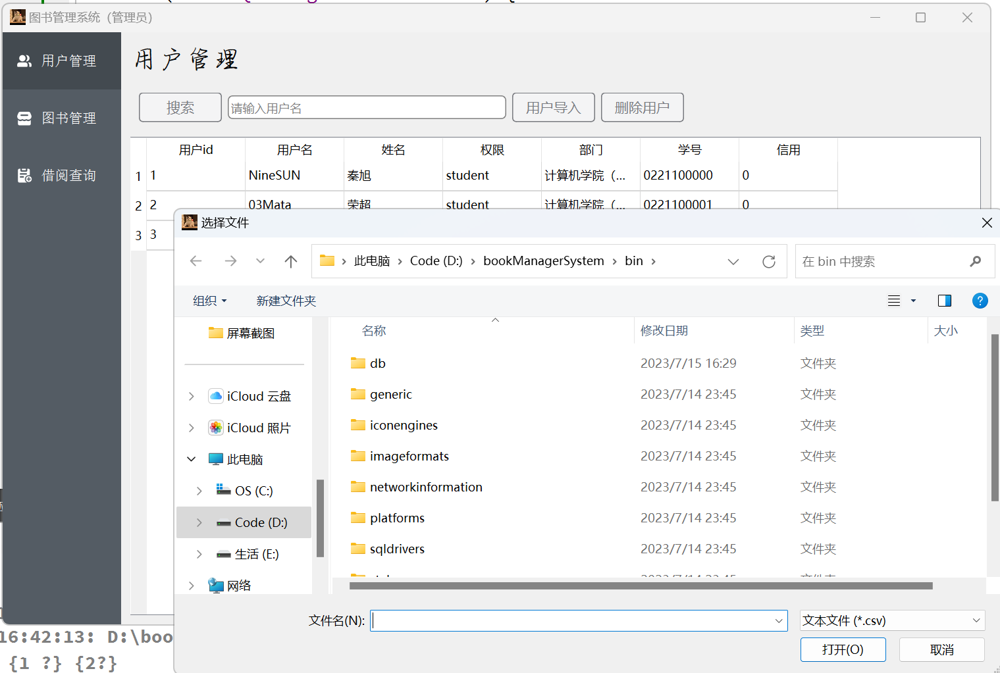

* 点击删除用户，输入用户id即可删除

  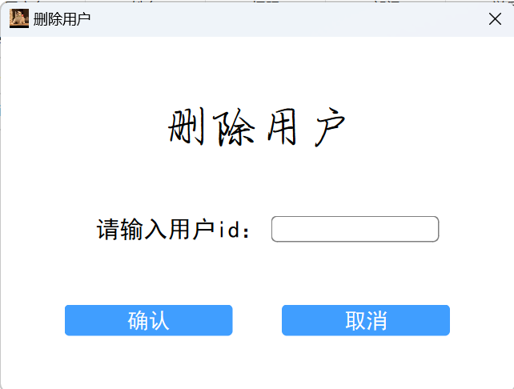

#### 图书管理

* 图书管理主界面展示了数据库中所有的图书信息，也提供了与用户管理一样的搜索功能，支持模糊搜索

  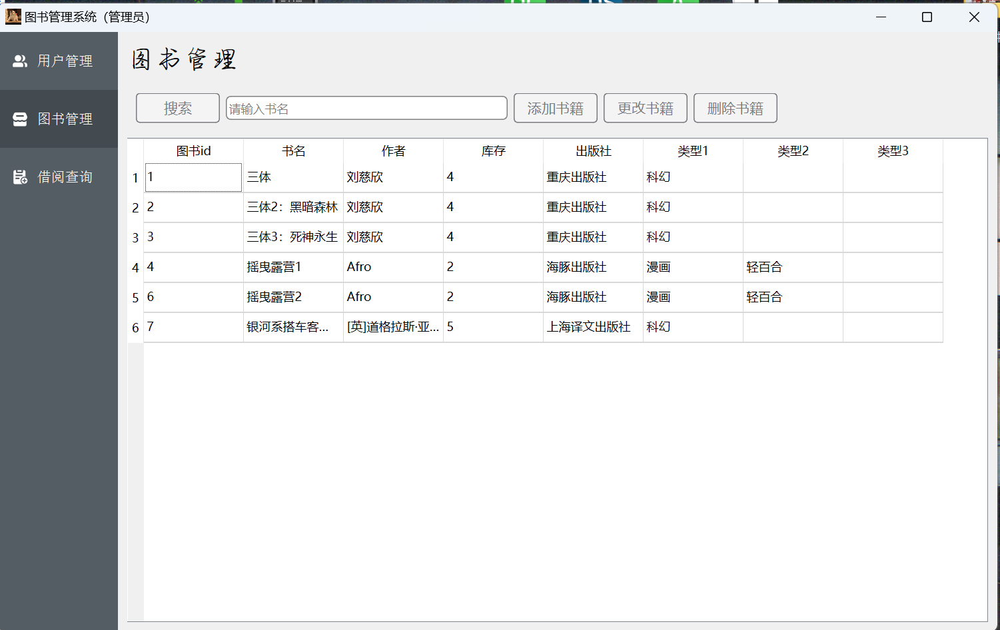

* 点击添加书籍按钮，输入图书的信息即可成功添加书籍

  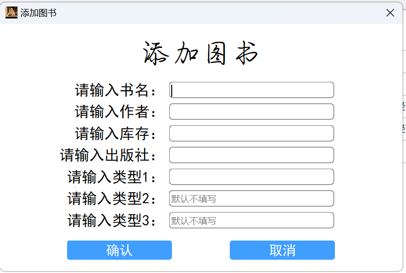

* 点击更改图书按钮，输入相关数据即可实现图书信息的更改

  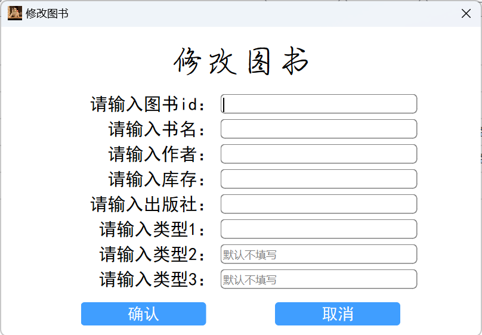

* 点击删除图书，输入图书id即可实现图书的删除功能

  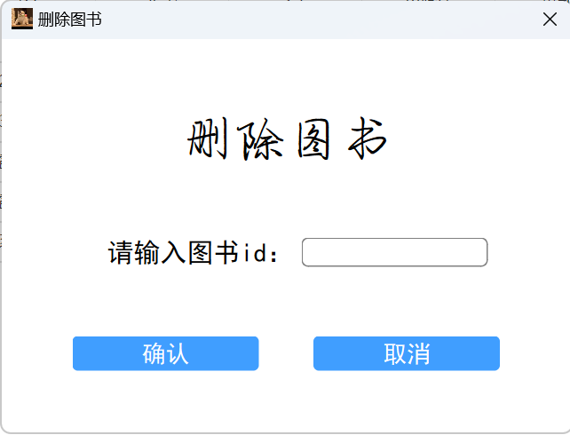

* 上述功能在完成后主界面的图书信息均会实时更新

#### 借阅查询

* 借阅查询展示了数据库中存储的所有用户借阅的信息，便于管理员管理

  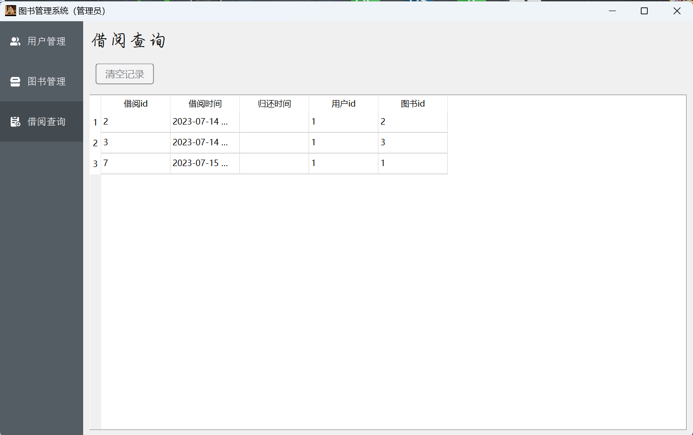

* 点击清空记录后便可以实现清空图书的借阅记录（仅支持删除已经归还的借阅记录，若归还时间为空则不会进行删除操作）

  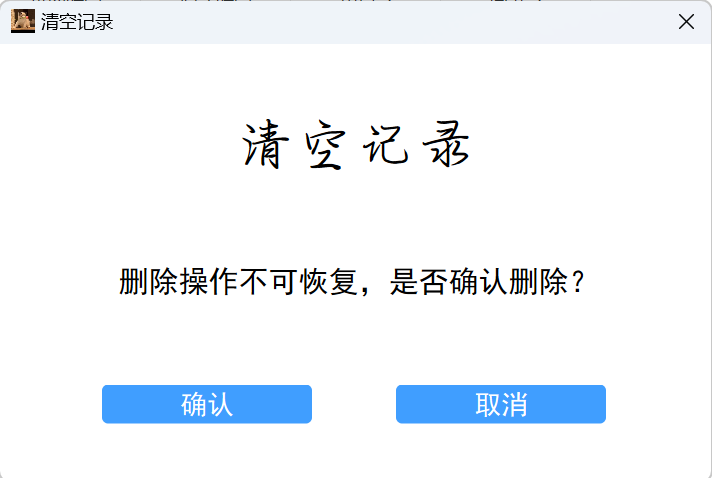

* 清空操作完成后会实时更新主界面